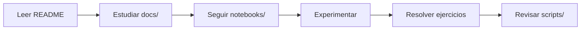
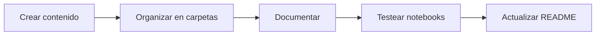

# Arquitectura del Proyecto

Este documento describe la estructura y organización del curso de Data Science y Machine Learning.

## Visión General

El proyecto está organizado para facilitar el aprendizaje progresivo de conceptos de Data Science, desde fundamentos hasta técnicas avanzadas de Deep Learning.

## Estructura de Directorios

```
data_science_henry/
│
├── clase_XX_nombre/              # 11 carpetas de clases (01-11)
│   ├── notebooks/                # Jupyter notebooks
│   │   ├── 01_concepto.ipynb
│   │   ├── 02_practica.ipynb
│   │   └── 03_ejercicios.ipynb
│   ├── scripts/                  # Scripts Python reutilizables
│   │   ├── model_utils.py
│   │   └── data_helpers.py
│   ├── docs/                     # Documentación y recursos
│   │   ├── slides.pdf
│   │   ├── referencias.md
│   │   └── ejercicios.pdf
│   ├── data/                     # Datos específicos de la clase
│   │   ├── dataset.csv
│   │   └── processed/
│   └── README.md                 # Descripción de la clase
│
├── data/                         # Datos compartidos entre clases
│   ├── raw/                      # Datos originales sin procesar
│   ├── processed/                # Datos procesados y limpios
│   └── external/                 # Datos de fuentes externas
│
├── utils/                        # Utilidades compartidas
│   ├── __init__.py               # Exports principales
│   ├── data_processing.py        # Procesamiento de datos
│   ├── visualization.py          # Funciones de visualización
│   └── model_evaluation.py       # Evaluación de modelos
│
├── tests/                        # Tests unitarios
│   ├── __init__.py
│   ├── test_data_processing.py
│   └── test_model_evaluation.py
│
├── docs/                         # Documentación general (opcional)
│   ├── guias/
│   └── referencias/
│
├── .env.example                  # Template de variables de entorno
├── .gitignore                    # Archivos a ignorar en Git
├── CONTRIBUTING.md               # Guía de contribución
├── LICENSE                       # Licencia MIT
├── Makefile                      # Comandos automatizados
├── QUICKSTART.md                 # Guía de inicio rápido
├── README.md                     # Documentación principal
├── pyproject.toml                # Configuración de Poetry
├── requirements.txt              # Dependencias (backup)
└── setup.py                      # Instalación del paquete
```

## Componentes Principales

### 1. Clases (clase_XX_nombre/)

Cada clase sigue una estructura consistente:

#### notebooks/
- **Propósito**: Material educativo interactivo
- **Contenido**: Teoría, ejemplos prácticos, ejercicios
- **Convención de nombres**: `XX_nombre_descriptivo.ipynb`
- **Orden**: Numérico, desde conceptos básicos a avanzados

#### scripts/
- **Propósito**: Código reutilizable y modular
- **Contenido**: Funciones, clases, utilidades
- **Uso**: Importados en notebooks o ejecutados standalone
- **Estilo**: PEP 8, type hints, docstrings completos

#### docs/
- **Propósito**: Material de lectura y referencia
- **Contenido**: PDFs, markdown, slides, papers
- **Organización**: Por tema o sesión

#### data/
- **Propósito**: Datasets específicos de la clase
- **Contenido**: CSV, JSON, imágenes, etc.
- **Nota**: Archivos grandes en .gitignore

### 2. Datos Compartidos (data/)

#### raw/
- Datos originales sin modificar
- Nunca se editan directamente
- Fuente de verdad para procesamiento

#### processed/
- Datos limpios y transformados
- Listos para modelado
- Documentar transformaciones aplicadas

#### external/
- Datos de APIs o fuentes externas
- Pueden requerir credenciales
- Ver `.env.example`

### 3. Utilidades (utils/)

Módulo de Python con funciones compartidas:

#### data_processing.py
```python
- load_data()          # Cargar diferentes formatos
- clean_data()         # Limpieza de datos
- split_data()         # Train/test split
- scale_features()     # Escalado de features
```

#### visualization.py
```python
- plot_confusion_matrix()    # Matriz de confusión
- plot_roc_curve()           # Curva ROC
- plot_learning_curves()     # Curvas de aprendizaje
- plot_feature_importance()  # Importancia de features
```

#### model_evaluation.py
```python
- evaluate_classification()  # Métricas de clasificación
- evaluate_regression()      # Métricas de regresión
- cross_validate_model()     # Validación cruzada
- print_metrics()            # Pretty print de métricas
```

### 4. Configuración y Gestión

#### pyproject.toml
- Gestión de dependencias con Poetry
- Configuración de herramientas (black, isort, pytest)
- Metadata del proyecto

#### Makefile
- Automatización de tareas comunes
- Instalación, testing, formateo
- Comandos: `make help` para ver todos

#### .env.example
- Template para variables de entorno
- NUNCA commitear archivo `.env` real
- Contiene: paths, API keys, configuraciones

## Flujo de Trabajo

### Para Estudiantes



1. **Preparación**: Leer README de la clase
2. **Teoría**: Estudiar material en docs/
3. **Práctica**: Ejecutar notebooks paso a paso
4. **Experimentación**: Modificar código, probar variaciones
5. **Ejercicios**: Resolver problemas propuestos
6. **Profundización**: Analizar scripts/

### Para Instructores



1. **Desarrollo**: Crear notebooks y scripts
2. **Organización**: Ubicar en estructura correcta
3. **Documentación**: Comentarios y docstrings
4. **Testing**: Ejecutar todo el código
5. **README**: Actualizar guías de clase

## Gestión de Dependencias

### Agregar Nueva Librería

```bash
# Con Poetry
poetry add nombre-libreria

# Especificar versión
poetry add "libreria>=1.0.0"

# Solo para desarrollo
poetry add --group dev pytest-mock
```

### Actualizar Librerías

```bash
# Actualizar todas
poetry update

# Actualizar una específica
poetry update nombre-libreria
```

## Testing

### Estructura de Tests

```
tests/
├── __init__.py
├── conftest.py              # Fixtures compartidas
├── test_data_processing.py  # Tests de procesamiento
├── test_visualization.py    # Tests de visualización
└── test_model_evaluation.py # Tests de evaluación
```

### Ejecutar Tests

```bash
# Todos los tests
make test

# Con cobertura
poetry run pytest --cov=utils --cov-report=html

# Un archivo específico
poetry run pytest tests/test_data_processing.py -v
```

## Versionado

### Git Workflow

```bash
# Feature branch
git checkout -b feature/nueva-clase

# Commits descriptivos
git commit -m "Agrega notebooks de clase 05"

# Push y PR
git push origin feature/nueva-clase
```

### Semantic Versioning

- **Major** (1.0.0): Cambios incompatibles
- **Minor** (0.1.0): Nueva funcionalidad compatible
- **Patch** (0.0.1): Bug fixes

## Mejores Prácticas

### Notebooks

1. **Estructura clara**
   - Título descriptivo
   - Índice de contenidos
   - Secciones bien definidas

2. **Código limpio**
   - Celdas no muy largas
   - Comentarios explicativos
   - Output relevante

3. **Reproducibilidad**
   - Establecer random seeds
   - Documentar versiones
   - Limpiar outputs antes de commit

### Scripts

1. **Modularidad**
   - Una función = una responsabilidad
   - Funciones pequeñas y testeables
   - Evitar código duplicado

2. **Documentación**
   - Docstrings completos (Google/NumPy style)
   - Type hints en firmas
   - Ejemplos de uso

3. **Manejo de errores**
   - Validación de inputs
   - Mensajes de error claros
   - Logging apropiado

## Escalabilidad

### Agregar Nueva Clase

1. Crear directorio: `clase_XX_nombre/`
2. Crear subdirectorios: notebooks/, scripts/, docs/, data/
3. Agregar README.md con estructura estándar
4. Actualizar README.md principal

### Extender Utilidades

1. Agregar función en módulo apropiado
2. Actualizar `__init__.py` con export
3. Agregar tests
4. Documentar en docstring
5. Actualizar README si es público

## Recursos

### Documentación Técnica
- [Poetry Documentation](https://python-poetry.org/docs/)
- [Jupyter Best Practices](https://jupyter-notebook.readthedocs.io/)
- [Scikit-learn User Guide](https://scikit-learn.org/stable/user_guide.html)

### Estándares de Código
- [PEP 8](https://pep8.org/)
- [Google Python Style Guide](https://google.github.io/styleguide/pyguide.html)
- [NumPy Docstring Guide](https://numpydoc.readthedocs.io/)

---

**Última actualización**: Enero 2026
**Mantenedor**: Mariano Gobea (mariano.gobea@mercadolibre.com)
