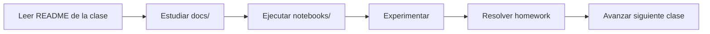
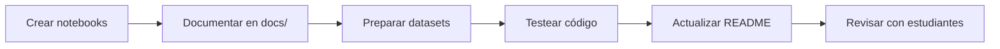

# 🏗️ Arquitectura del Proyecto
## Estructura y Organización del Curso de Data Science

**Última actualización**: Febrero 2026  
**Versión**: 1.0.0

---

## 📋 Visión General

El proyecto está organizado para facilitar el aprendizaje progresivo de conceptos de Data Science, desde fundamentos de Machine Learning hasta técnicas avanzadas de Deep Learning.

**Principios de diseño:**
- ✅ **Modularidad**: Cada clase es independiente pero progresiva
- ✅ **Consistencia**: Estructura similar en todas las clases
- ✅ **Practicidad**: Casos reales de negocio
- ✅ **Reproducibilidad**: Seeds fijas, documentación exhaustiva

---

## 🗂️ Estructura de Directorios REAL

**Nota**: Esta estructura refleja el estado ACTUAL del proyecto post-limpieza (Febrero 2026).

```
data_science_henry/
│
├── clase_01_introduccion_ml/
│   ├── notebooks/                  # 3 notebooks
│   │   ├── resumen_actividad_clase_01.ipynb
│   │   ├── actividad_clase_01_eda_retailboost.ipynb
│   │   └── 02_homework_eda_retailboost.ipynb
│   ├── scripts/                    # 2 scripts (ÚNICA clase con scripts)
│   │   ├── preprocessing.py        # Funciones de preprocesamiento
│   │   └── data_loader.py          # Carga de datos
│   ├── docs/                       # 3 documentos
│   │   ├── actividad_clase.md
│   │   ├── resumen_contenidos.md
│   │   └── homework.md
│   ├── data/                       # 5 datasets
│   │   ├── retailboost_customers.csv
│   │   ├── retailboost_customers_processed.csv
│   │   ├── retailboost_customers_procesado.csv
│   │   └── retailboost_customers_final.csv
│   └── README.md
│
├── clase_02_regresion/
│   ├── notebooks/                  # 3 notebooks
│   ├── scripts/                    # 1 script
│   │   └── get_metrics.py          # Métricas de regresión
│   ├── docs/                       # 3 documentos
│   ├── data/                       # 1 dataset
│   └── README.md
│
├── clase_03_regresion_logistica/
│   ├── notebooks/                  # 2 notebooks
│   ├── docs/                       # 4 documentos
│   ├── data/                       # 1 dataset
│   └── README.md
│
├── clase_04_clasificacion_metricas/
│   ├── notebooks/                  # 1 notebook
│   ├── docs/                       # 2 documentos
│   └── data/                       # 1 dataset
│
├── clase_05_modelos_ensamble/
│   ├── notebooks/                  # 1 notebook
│   └── docs/                       # 2 documentos
│
├── clase_06_optimizacion_modelos/
│   ├── notebooks/                  # 3 notebooks
│   │   ├── 2_GradientBoosting_Optimizacion.ipynb
│   │   ├── 2_GradientBoosting_Optimizacion_RESUMEN.ipynb
│   │   └── catboost_info/          # Subdirectorio auxiliar
│   └── docs/                       # 2 documentos
│
├── clase_07_aprendizaje_no_supervisado_i/
│   ├── notebooks/                  # 2 notebooks
│   ├── docs/                       # 2 documentos
│   └── data/                       # 3 datasets
│
├── clase_08_aprendizaje_no_supervisado_ii/
│   ├── notebooks/                  # 2 notebooks + 1 markdown
│   ├── docs/                       # 2 documentos
│   └── data/                       # 4 datasets
│
├── clase_09_series_temporales/
│   ├── notebooks/                  # 2 notebooks
│   ├── docs/                       # 4 documentos
│   └── data/                       # 1 dataset
│
├── clase_10_deep_learning/ ⭐       # CLASE MÁS COMPLETA
│   ├── notebooks/                  # 4 notebooks + 2 markdown guías
│   │   ├── homework_vix_lstm_completo_didactico.ipynb ⭐
│   │   ├── econotrend_lstm_forecast.ipynb
│   │   ├── finshield_pytorch_dense_Edited_Leo2.ipynb
│   │   ├── LECTURAS_COMPLETAS_POR_CELDA.md
│   │   └── CORRECCIONES.md
│   ├── docs/                       # 7 documentos
│   │   ├── homework.md
│   │   ├── resumen_contenidos.md
│   │   ├── ANALISIS_COMPLETO_VIX_LSTM.md
│   │   ├── LECTURAS_RECOMENDADAS_VIX_LSTM.md
│   │   ├── VERIFICACION_AFIRMACIONES_DATOS.md
│   │   ├── INDICE_RAPIDO.md
│   │   └── README_ANALISIS_COMPLETO.md
│   ├── data/                       # 2 datasets
│   │   ├── econotrend_vix_sim.csv
│   │   └── finshield_transactions_clean.csv
│   └── README.md
│
├── clase_11_consulta/               # A COMPLETAR
│   ├── notebooks/                  # Resumen de todo el curso
│   ├── data/                       # Resumen de datasets y casos
│   └── README.md
│
├── utils/                          # Utilidades compartidas
│   ├── __init__.py
│   ├── data_processing.py
│   ├── visualization.py
│   └── model_evaluation.py
│
├── tests/                          # Tests unitarios
│   ├── __init__.py
│   └── test_*.py
│
├── docs/                           # Documentación general
│   └── (vacío por ahora)
│
├── .venv/                          # Entorno virtual (auto-generado)
├── .git/                           # Control de versiones
├── .gitignore                      # Archivos ignorados
├── .env.example                    # Template de variables
├── .claude/                        # Configuración de Claude (AI)
│
├── README.md                       # Documentación principal
├── QUICKSTART.md                   # Guía de inicio rápido
├── ARCHITECTURE.md                 # Este archivo
├── CONTRIBUTING.md                 # Guía de contribución
├── LICENSE                         # Licencia MIT
├── Makefile                        # Comandos automatizados
├── pyproject.toml                  # Poetry config
├── poetry.lock                     # Lock file de dependencias
├── requirements.txt                # Backup para pip
└── setup.py                        # Instalación como paquete
```

---

## 📊 Estadísticas Actuales

| Métrica | Cantidad |
|---------|----------|
| **Total de clases** | 11 |
| **Notebooks** | 23 |
| **Datasets únicos** | 20 |
| **Documentos** | 31 |
| **Scripts Python** | 3 (clase_01, clase_02) |
| **Líneas de código** | ~15,000 (notebooks) |
| **Tamaño total** | ~50 MB (sin .venv) |

---

## 🎯 Convenciones y Estándares

### Nombres de Archivos

**Notebooks:**
- Formato: `[numero]_[nombre_descriptivo].ipynb`
- Ejemplos: 
  - `01_exploratory_data_analysis.ipynb`
  - `homework_clasificacion_leads.ipynb`
  - `actividad_clase_03_regresion_logistica.ipynb`

**Scripts:**
- Formato: `snake_case.py`
- Ejemplos: `data_loader.py`, `get_metrics.py`, `preprocessing.py`

**Documentos:**
- Formato: `snake_case.md` o `nombre_descriptivo.md`
- Ejemplos: `homework.md`, `resumen_contenidos.md`, `temas_clase.md`

**Datasets:**
- Formato: `[proyecto]_[entidad]_[estado].csv`
- Ejemplos: 
  - `retailboost_customers.csv` (raw)
  - `retailboost_customers_processed.csv` (procesado)
  - `finshield_transactions_clean.csv` (limpio)

### Organización de Notebooks

**Estructura estándar:**

1. **Título y Contexto** (Markdown)
2. **Tabla de contenidos** (con anclas)
3. **Importación de librerías** (Código)
4. **Configuración** (seeds, parámetros)
5. **Carga de datos** (Código)
6. **EDA** (Código + visualizaciones)
7. **Preprocesamiento** (Código)
8. **Modelado** (Código)
9. **Evaluación** (Código + métricas)
10. **Conclusiones** (Markdown)

**Best practices:**
- Celdas de código cortas (<50 líneas)
- Comentarios explicativos
- Outputs limpios y relevantes
- Visualizaciones con títulos y labels
- Seeds fijas para reproducibilidad

---

## 🔄 Flujo de Trabajo

### Para Estudiantes



**Pasos detallados:**

1. **Preparación** (10 min):
   - Leer README.md de la clase
   - Revisar `resumen_contenidos.md` en docs/

2. **Teoría** (30 min):
   - Estudiar material teórico en docs/
   - Revisar referencias externas

3. **Práctica** (90 min):
   - Ejecutar notebooks paso a paso
   - Leer comentarios y explicaciones

4. **Experimentación** (30 min):
   - Modificar parámetros
   - Probar diferentes enfoques
   - Visualizar resultados

5. **Homework** (60 min):
   - Resolver ejercicios propuestos
   - Documentar decisiones

### Para Instructores



**Checklist antes de cada clase:**

- [ ] Notebooks ejecutan sin errores
- [ ] Outputs limpiados (para Git)
- [ ] Seeds fijas (reproducibilidad)
- [ ] Documentación actualizada
- [ ] Datasets disponibles en data/
- [ ] README de la clase completo
- [ ] Homework claramente definido

---

## 🛠️ Gestión de Dependencias

### Con Poetry (Recomendado)

```bash
# Agregar librería
poetry add nombre-libreria

# Agregar con versión específica
poetry add "numpy>=1.26.0,<2.0.0"

# Agregar para desarrollo (no producción)
poetry add --group dev pytest-cov

# Actualizar todas las dependencias
poetry update

# Ver árbol de dependencias
poetry show --tree

# Exportar a requirements.txt
poetry export -f requirements.txt --output requirements.txt
```

### Grupos de Dependencias

**En `pyproject.toml`:**

```toml
[tool.poetry.dependencies]
python = "^3.9"
numpy = "^1.26.4"
pandas = "^2.3.3"
...

[tool.poetry.group.dev.dependencies]
pytest = "^8.0.0"
black = "^24.0.0"
...
```

---

## 🧪 Testing y Calidad

### Estructura de Tests

```
tests/
├── __init__.py
├── conftest.py                    # Fixtures compartidas
├── test_data_processing.py        # Tests de utils/data_processing.py
├── test_visualization.py          # Tests de utils/visualization.py
└── test_model_evaluation.py       # Tests de utils/model_evaluation.py
```

### Ejecutar Tests

```bash
# Todos los tests
make test
# o
poetry run pytest

# Con cobertura
poetry run pytest --cov=utils --cov-report=html

# Test específico
poetry run pytest tests/test_data_processing.py -v

# Con output verbose
poetry run pytest -vv
```

---

## 🔌 Utilidades Compartidas (utils/)

Módulo de Python con funciones reutilizables entre clases.

### `data_processing.py`
```python
def load_data(path, **kwargs) -> pd.DataFrame
    """Carga datos de diferentes formatos."""
    
def clean_data(df) -> pd.DataFrame
    """Limpieza estándar de datos."""
    
def split_temporal(df, test_size=0.2) -> tuple
    """División respetando orden temporal."""
    
def create_sequences(series, lookback=10) -> tuple
    """Crea ventanas deslizantes para series temporales."""
```

### `visualization.py`
```python
def plot_confusion_matrix(y_true, y_pred, **kwargs)
    """Matriz de confusión con Seaborn."""
    
def plot_roc_curve(y_true, y_proba, **kwargs)
    """Curva ROC con AUC."""
    
def plot_learning_curves(train_scores, test_scores, **kwargs)
    """Curvas de aprendizaje."""
    
def plot_feature_importance(model, feature_names, **kwargs)
    """Importancia de características."""
```

### `model_evaluation.py`
```python
def evaluate_classification(y_true, y_pred, **kwargs) -> dict
    """Métricas completas de clasificación."""
    
def evaluate_regression(y_true, y_pred, **kwargs) -> dict
    """Métricas completas de regresión."""
    
def cross_validate_model(model, X, y, **kwargs) -> dict
    """Validación cruzada con múltiples métricas."""
    
def print_metrics(metrics, **kwargs)
    """Pretty print de métricas."""
```

---

## 📚 Contenido por Clase

### Resumen Ejecutivo

| Clase | Notebooks | Datasets | Scripts | Caso Práctico | Nivel |
|-------|-----------|----------|---------|---------------|-------|
| **01** | 3 | 5 | 2 | RetailBoost EDA | Básico |
| **02** | 3 | 1 | 1 | RetailBoost Regresión | Básico |
| **03** | 2 | 1 | 0 | Churn Bancario | Intermedio |
| **04** | 1 | 1 | 0 | Leads Fintech | Intermedio |
| **05** | 1 | 0 | 0 | Ensambles | Intermedio |
| **06** | 3 | 0 | 0 | Optimización | Avanzado |
| **07** | 2 | 3 | 0 | ShopSense Clustering | Intermedio |
| **08** | 2 | 4 | 0 | ShopSense Recomendaciones | Avanzado |
| **09** | 2 | 1 | 0 | CityScoot Forecasting | Avanzado |
| **10** | 4 | 2 | 0 | FinShield + EconoTrend | Avanzado |
| **11** | 0 | 0 | 0 | Consulta/Repaso | - |

---

## 🎯 Casos Prácticos por Dominio

### **Retail & E-commerce**
- **RetailBoost** (Clases 01-02): EDA y predicción de valor de cliente
- **ShopSense** (Clases 07-08): Segmentación y recomendaciones

### **Finanzas & Fintech**
- **Churn Bancario** (Clase 03): Predicción de abandono de clientes
- **MarTech** (Clase 04): Clasificación de leads de conversión
- **EconoTrend** (Clase 10): Predicción del índice VIX (volatilidad)
- **FinShield** (Clase 10): Detección de fraude transaccional

### **Movilidad**
- **CityScoot** (Clase 09): Forecasting de demanda de scooters eléctricos

---

## 🏆 Clase Destacada: Deep Learning (Clase 10)

### Características especiales:

**Documentación extensiva** (7 documentos en docs/):
1. `homework.md` - Consigna del trabajo
2. `resumen_contenidos.md` - Teoría de Deep Learning
3. `ANALISIS_COMPLETO_VIX_LSTM.md` - Análisis exhaustivo de resultados (447 líneas)
4. `LECTURAS_RECOMENDADAS_VIX_LSTM.md` - 30+ recursos organizados (382 líneas)
5. `VERIFICACION_AFIRMACIONES_DATOS.md` - 87 afirmaciones verificadas (257 líneas)
6. `INDICE_RAPIDO.md` - Referencia rápida de valores
7. `README_ANALISIS_COMPLETO.md` - Índice maestro

**Material para instructores** (en notebooks/):
- `LECTURAS_COMPLETAS_POR_CELDA.md` - Script para comentarios en clase
- `CORRECCIONES.md` - Soluciones a problemas comunes

**Notebook principal**:
- `homework_vix_lstm_completo_didactico.ipynb`
- 3,066 líneas de código y documentación
- 1.6 MB de contenido didáctico
- 100% ejecutable de principio a fin
- Incluye WIKIs, visualizaciones, lecturas recomendadas
- Basado en datos reales (outputs verificados)

---

## 🔄 Gestión de Versiones

### Git Workflow

```bash
# Feature branch
git checkout -b feature/clase-12-nlp

# Commits descriptivos
git add .
git commit -m "Agrega notebooks de procesamiento de lenguaje natural"

# Push
git push origin feature/clase-12-nlp
```

### Semantic Versioning

- **Major (1.0.0)**: Cambios incompatibles (ej: nueva estructura de carpetas)
- **Minor (0.1.0)**: Nueva funcionalidad compatible (ej: nueva clase)
- **Patch (0.0.1)**: Bug fixes y mejoras menores

**Versión actual**: 1.0.0

---

## 📏 Mejores Prácticas

### Notebooks

✅ **SÍ hacer:**
- Estructura clara con secciones numeradas
- Tabla de contenidos con anclas (`<a id='seccion'></a>`)
- Comentarios explicativos en código
- Celdas cortas (<50 líneas)
- Seeds fijas (RANDOM_SEED = 42)
- Outputs relevantes (no todo el DataFrame)
- Visualizaciones con títulos y labels
- Conclusiones al final

❌ **NO hacer:**
- Celdas de 200+ líneas
- Código sin comentarios
- Outputs de DataFrames completos (1000+ filas)
- Variables con nombres ambiguos (df1, df2, x, y)
- Múltiples versiones del mismo código
- Magic numbers (usar constantes)

### Scripts

✅ **SÍ hacer:**
- Docstrings completos (Google/NumPy style)
- Type hints en firmas de funciones
- Validación de inputs
- Manejo de errores con try/except
- Logging apropiado
- Tests unitarios

**Ejemplo:**

```python
def calculate_mae(y_true: np.ndarray, y_pred: np.ndarray) -> float:
    \"\"\"
    Calcula el Mean Absolute Error.
    
    Args:
        y_true: Valores reales. Shape: (N,)
        y_pred: Predicciones. Shape: (N,)
        
    Returns:
        MAE: Error absoluto medio
        
    Raises:
        ValueError: Si los arrays tienen shapes diferentes
        
    Example:
        >>> y_true = np.array([1, 2, 3])
        >>> y_pred = np.array([1.1, 2.2, 2.9])
        >>> calculate_mae(y_true, y_pred)
        0.13333...
    \"\"\"
    if y_true.shape != y_pred.shape:
        raise ValueError(f"Shapes no coinciden: {y_true.shape} vs {y_pred.shape}")
    
    return np.mean(np.abs(y_true - y_pred))
```

### Documentación

**Cada clase debe tener:**

1. **README.md** con:
   - Objetivos de aprendizaje
   - Temas cubiertos
   - Archivos principales
   - Orden de estudio sugerido

2. **docs/resumen_contenidos.md** con:
   - Teoría de los temas
   - Fórmulas y conceptos clave
   - Referencias y lecturas

3. **docs/homework.md** (si aplica) con:
   - Consigna clara
   - Datasets a usar
   - Criterios de evaluación
   - Entregables esperados

---

## 🔐 Gestión de Secretos

### Variables de Entorno

**Archivo `.env.example`** (template):
```bash
# General
RANDOM_STATE=42
N_JOBS=-1
LOG_LEVEL=INFO

# Paths
DATA_DIR=./data
MODELS_DIR=./models

# API Keys (si se usan)
# KAGGLE_USERNAME=your_username
# KAGGLE_KEY=your_api_key
```

**⚠️ NUNCA commitear `.env` real** (incluido en `.gitignore`)

### Datos Sensibles

- Datasets públicos → commit OK
- Datasets privados → .gitignore + README con instrucciones de descarga
- API Keys → variables de entorno
- Contraseñas → NUNCA en código

---

## 🚀 Escalabilidad

### Agregar Nueva Clase

```bash
# 1. Crear estructura
mkdir clase_XX_nombre_tema
cd clase_XX_nombre_tema
mkdir notebooks docs data

# 2. Crear README
touch README.md

# 3. Agregar notebooks
# ... crear notebooks en notebooks/

# 4. Actualizar README.md principal
# ... agregar la nueva clase a la tabla

# 5. Commit
git add .
git commit -m "Agrega clase XX: Nombre del Tema"
```

### Extender Utilidades (utils/)

1. Agregar función en módulo apropiado
2. Actualizar `__init__.py` con export
3. Agregar tests en tests/
4. Documentar con docstring completo
5. Actualizar README si es público

---

## 📚 Dependencias Principales

### Core (Production)

```toml
python = "^3.9"
numpy = "^1.26.4"
pandas = "^2.3.3"
matplotlib = "^3.10.8"
seaborn = "^0.13.2"
scikit-learn = "^1.5.2"
torch = "^2.2.2"
xgboost = "^2.1.3"
lightgbm = "^4.5.0"
catboost = "^1.2.7"
statsmodels = "^0.14.4"
optuna = "^4.1.0"
jupyter = "^1.1.1"
jupyterlab = "^4.3.4"
```

### Development

```toml
pytest = "^8.3.4"
pytest-cov = "^6.0.0"
black = "^24.10.0"
flake8 = "^7.1.1"
mypy = "^1.13.0"
ipykernel = "^6.29.5"
```

**Total de dependencias**: ~50 paquetes (con subdependencias: ~200)

---

## 📊 Casos de Uso de Notebooks

### Por Propósito

| Propósito | Ejemplo | Ubicación |
|-----------|---------|-----------|
| **Introducción teórica** | resumen_actividad_clase_01 | clase_01/notebooks |
| **Actividad en clase** | actividad_clase_02_regresion | clase_02/notebooks |
| **Homework** | homework_vix_lstm_completo | clase_10/notebooks |
| **Referencia rápida** | econotrend_lstm_forecast | clase_10/notebooks |
| **Comparación de modelos** | 2_GradientBoosting_Optimizacion | clase_06/notebooks |

### Por Complejidad

| Nivel | Notebooks | Ejemplos |
|-------|-----------|----------|
| **Principiante** | 5 | EDA, Regresión simple |
| **Intermedio** | 12 | Clasificación, Clustering |
| **Avanzado** | 6 | Series temporales, Deep Learning |

---

## 🌐 Recursos Externos

### Documentación Oficial
- [Scikit-learn User Guide](https://scikit-learn.org/stable/user_guide.html)
- [PyTorch Tutorials](https://pytorch.org/tutorials/)
- [Pandas Documentation](https://pandas.pydata.org/docs/)
- [Statsmodels Documentation](https://www.statsmodels.org/)

### Papers Fundamentales
- Hochreiter & Schmidhuber (1997): "Long Short-Term Memory"
- Breiman (2001): "Random Forests"
- Chen & Guestrin (2016): "XGBoost: A Scalable Tree Boosting System"

### Cursos Complementarios
- [Fast.ai Practical Deep Learning](https://www.fast.ai/)
- [Andrew Ng - Machine Learning Specialization](https://www.coursera.org/specializations/machine-learning-introduction)
- [PyTorch Official Course](https://pytorch.org/tutorials/beginner/deep_learning_60min_blitz.html)

---

## 🎓 Habilidades Adquiridas

Al completar este curso, dominarás:

✅ **Fundamentos de ML**: Supervisado, no supervisado, validación  
✅ **Regresión y Clasificación**: Modelos lineales y no lineales  
✅ **Ensambles**: Bagging, Boosting, Stacking  
✅ **Optimización**: Grid Search, Random Search, Optuna  
✅ **Clustering**: K-Means, DBSCAN, Hierarchical  
✅ **Recomendaciones**: Filtrado colaborativo y basado en contenido  
✅ **Series Temporales**: ARIMA, Prophet, ML para forecasting  
✅ **Deep Learning**: Redes densas, LSTM en PyTorch  
✅ **Interpretabilidad**: SHAP, LIME, feature importance  
✅ **Mejores prácticas**: Reproducibilidad, documentación, testing

---

## 🤝 Contribución

### Cómo Contribuir

1. Fork el repositorio
2. Crea una rama para tu feature (`git checkout -b feature/nueva-clase`)
3. Commit tus cambios (`git commit -m 'Agrega clase XX'`)
4. Push a la rama (`git push origin feature/nueva-clase`)
5. Abre un Pull Request

Ver `CONTRIBUTING.md` para guía completa.

### Qué Contribuir

- ✅ Nuevos notebooks de ejemplos
- ✅ Datasets adicionales
- ✅ Mejoras en documentación
- ✅ Correcciones de errores
- ✅ Casos de uso adicionales
- ✅ Scripts de utilidades

---

## 📞 Soporte y Contacto

**Instructor**: Mariano Gobea  
**Email**: mariano.gobea@mercadolibre.com  
**Issues**: [GitHub Issues](https://github.com/tu-repo/data_science_henry/issues)

**Clase de consulta**: Lunes próximo (Clase 11)

---

## 📜 Licencia

Este proyecto educativo está bajo la **Licencia MIT**.

```
Copyright (c) 2026 Mariano Gobea

Permission is hereby granted, free of charge, to any person obtaining a copy
of this software and associated documentation files (the "Software"), to deal
in the Software without restriction...
```

Ver archivo `LICENSE` para el texto completo.

---

## 🎉 ¡Comienza Ya!

```bash
# 1. Clona o navega al proyecto
cd data_science_henry

# 2. Instala dependencias
poetry install

# 3. Activa entorno
poetry shell

# 4. Abre tu primer notebook
jupyter lab clase_01_introduccion_ml/notebooks/resumen_actividad_clase_01.ipynb
```

---

**Última actualización**: Febrero 16, 2026  
**Mantenedor**: Mariano Gobea  
**Versión**: 1.0.0

🚀 **¡Éxito en tu aprendizaje!**
